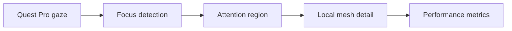

<p align="center">
  <a href="https://www.linkedin.com/in/patel7nv">LinkedIn</a> ·
  <a href="mailto:patel7nv@mail.uc.edu">Email</a> ·
  Cincinnati, Ohio
</p>

<p align="center"><sub>This profile is built from code: a hand-authored SVG, GitHub-rendered diagrams, and real project captures.</sub></p>

## `01 / about-me`

I'm a **Computer Science student at the University of Cincinnati** interested in the intersection of AI, software systems, cloud infrastructure, computer vision, and spatial computing.

- 🎓 Transferred to UC after completing my first two years at **Nirma University** in India
- 🔬 Completed a **Summer 2026 research internship** with UC's Office of Research / Digital Futures
- 🧠 I like building measurable systems—not just demos—and understanding where they fail
- ☁️ Currently strengthening my foundations in cloud architecture, ML/CV, distributed systems, and AI evaluation

## `02 / currently-building`

### OrbiT — Adaptive Agent Runtime

I'm exploring a model-agnostic orchestration system that can decide **how much computation a task deserves**: one agent or many, local or hosted models, sequential or parallel execution, and when extra verification is worth its cost.

```text
goal → analyze → choose strategy → execute → verify → learn
```

The current phase is **architecture and foundations**. The long-term direction is maximum verified useful work per unit of computation—not maximum agents or tokens.

## `03 / research`

### Attention-Aware VR Manufacturing Training

**Summer Research Intern · UC Office of Research / Digital Futures · May–July 2026**



Using **Unreal Engine, Meta Quest Pro, and a KAT VR treadmill**, I worked on a VR manufacturing-training environment and investigated gaze-guided geometric adaptation. The prototype captured gaze rays, confidence, attention regions, triangle counts, and frame performance for analysis.

| Example run | Measured result |
|---|---:|
| Runtime | **188.8 seconds** |
| Valid gaze samples | **95.7%** |
| Average gaze confidence | **0.962** |
| Average frame rate | **36.95 FPS** |

## `04 / selected-projects`

<table>
  <tr>
    <td width="50%" valign="top">
      <a href="https://github.com/Nihal0801/Langsam-418">
        
      </a>
      <h3>Langsam VR Classroom</h3>
      <p>Collaborative VR classroom with modeled environments, animated characters, controller interaction, and an in-world drawing system.</p>
      <p><code>Unity</code> <code>Blender</code> <code>Meta SDK</code> <code>C#</code></p>
    </td>
    <td width="50%" valign="top">
      <a href="https://github.com/Nihal0801/ar-knickknack">
        
      </a>
      <h3>AR Taj Mahal Knick-Knack</h3>
      <p>Marker-based AR scene with live weather, local time, contextual information, dynamic lighting, and ambient audio.</p>
      <p><code>Unity</code> <code>Vuforia</code> <code>C#</code> <code>OpenWeather</code></p>
    </td>
  </tr>
</table>

| Repository | What I built | Core technology |
|---|---|---|
| [Dynamic-Meshing](https://github.com/Nihal0801/Dynamic-Meshing) | Gaze-guided local geometric adaptation prototype | `Unreal Engine` `VR` `Eye Tracking` |
| [forage-midas](https://github.com/Nihal0801/forage-midas) | Transaction processing with REST APIs and Kafka messaging | `Java` `Spring` `Kafka` `H2` |

## `05 / technical-toolbox`

| Layer | Tools and concepts |
|---|---|
| **Languages** | `Python` `Java` `C` `C#` `JavaScript` `SQL` |
| **Backend & data** | `REST APIs` `Spring` `MySQL` `H2` `Kafka` `Testing` |
| **Spatial computing** | `Unreal Engine` `Unity` `Blender` `Meta Quest` `Vuforia` `Eye Tracking` |
| **Systems & workflow** | `Git` `GitHub` `Linux` `Data Structures` `Distributed Systems` |
| **Building toward** | `AWS` `Cloud Architecture` `ML/CV` `Multi-Agent Systems` `Model Routing` `AI Evaluation` |

## `06 / journey`

| When | Milestone |
|---|---|
| **2023–2025** | Began Computer Science at **Nirma University** · CGPA **8.46/10** |
| **2025–present** | Transferred to the **University of Cincinnati** for a BS in Computer Science |
| **Summer 2026** | Research intern at **UC Digital Futures / Smart Manufacturing Lab** |
| **Now** | Building toward **AI systems, cloud engineering, computer vision, and spatial computing** |

## `07 / highlights`

- 🏆 **CEAS International Outreach Scholarship**, University of Cincinnati
- 🏆 **CEAS Transfer Scholarship**, University of Cincinnati
- 🥽 Built projects spanning VR collaboration, gaze analytics, AR, backend services, and event-driven systems
- ⚡ Fun fact: I skipped the tutorial level of college and jumped straight into Year 3

---

<p align="center">
  <code>open to building · learning · research · collaboration</code><br /><br />
  <a href="https://www.linkedin.com/in/patel7nv"><strong>Connect on LinkedIn</strong></a>
  &nbsp;·&nbsp;
  <a href="mailto:patel7nv@mail.uc.edu"><strong>Send an email</strong></a>
</p>
