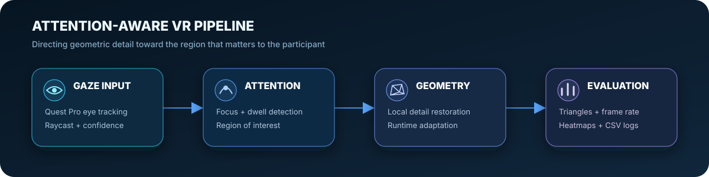
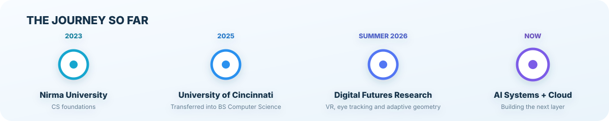

  
  
  

## About

I'm a Computer Science student at the **University of Cincinnati**, where I transferred after completing my first two years at **Nirma University** in India.

I like working where **AI, software systems, cloud infrastructure, and real-time computing** meet. My goal is not just to make impressive demos—it is to build measurable systems, understand their limitations, and keep improving how efficiently they solve real problems.

Currently, I am exploring the design of an **adaptive multi-agent AI runtime** that can select an appropriate execution strategy, models, tools, and verification process for each task.

## Research Highlight

### Attention-Aware VR Manufacturing Training

**Summer Research Intern · University of Cincinnati Office of Research / Digital Futures · May–July 2026**

- Built a VR manufacturing-training environment using **Unreal Engine, Meta Quest Pro, and the KAT VR treadmill**
- Investigated an **Attention-Aware Geometry Engine** that uses visual focus to preserve or restore geometric detail where it matters most
- Worked with gaze raycasting, heatmaps, focus detection, CSV logging, triangle metrics, and runtime performance analysis
- Presented the work through the **UC–Nirma Summer Research Internship Program**

| Example prototype run | Result |
|---|---:|
| Valid gaze samples | **95.7%** |
| Average gaze confidence | **0.962** |
| Average frame rate | **36.95 FPS** |

## Selected Projects

<table>
  <tr>
    <td width="50%" valign="top">
      
      <h3>Langsam VR Classroom</h3>
      
A collaborative virtual classroom featuring modeled environments, animated characters, controller interactions, and an in-world drawing system.

      
<strong>Unity · Blender · Meta SDK · C#</strong>

    </td>
    <td width="50%" valign="top">
      
      <h3>AR Taj Mahal Knick-Knack</h3>
      
A marker-based augmented-reality scene with live weather, local time, contextual information, lighting, and ambient audio.

      
<strong>Unity · Vuforia · C# · OpenWeather API</strong>

    </td>
  </tr>
</table>

| Project | Focus | Stack |
|---|---|---|
| [Attention-Aware Geometry](https://github.com/Nihal0801/Dynamic-Meshing) | Gaze-guided local geometric adaptation in Unreal Engine | Unreal Engine, VR, Eye Tracking |
| [JPMC Advanced Software Engineering](https://github.com/Nihal0801/forage-midas) | REST APIs, Kafka messaging, and transaction processing | Java, Spring, Kafka, H2 |

## Technical Toolbox

  

| Area | Technologies and concepts |
|---|---|
| **AI and data** | Computer vision, data analysis, gaze analytics, machine-learning fundamentals |
| **Software systems** | REST APIs, backend development, databases, testing, distributed-systems fundamentals |
| **Spatial computing** | Unreal Engine, Unity, Blender, Meta Quest, Vuforia, eye tracking |
| **Currently learning** | Cloud architecture, AWS, multi-agent systems, model routing, AI evaluation |

## Journey

## Current Direction

- Building toward **AI systems engineering** with a focus on orchestration, evaluation, reliability, and efficient computation
- Strengthening my foundations in **computer vision, machine learning, cloud computing, and scalable software design**
- Exploring how research prototypes can become reproducible, useful, and production-minded systems

> **Fun fact:** I skipped the tutorial level of college and jumped straight into Year 3.

---

  <strong>Interested in AI systems, cloud engineering, computer vision, or spatial computing?</strong> 
  <a href="https://www.linkedin.com/in/patel7nv">Let's connect on LinkedIn</a>

